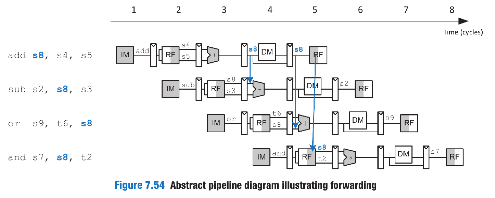

# A simple RISC-V CPU in SystemVerilog (single cycle and pipeline two version)

## Single Cycle Architecture

Here is the basic architecture including instruction memory, register file, ALU, and data memory.

- `bne`: MUX for the PC target
- `r-type`: MUX for result source

Control unit is composed of a main decoder and an ALU decoder.

The truth table of the main decoder is like:

|Instruction | Op | RegWrite | ImmSrc | ALUSrc | MemWrite | ResultSrc | Branch | ALUOp
| --------- | --------- | --------- | --- | --- | --- | --- | --- | --- |
| lw        | 0000011   |   1   |   00  |   1   |   0   |   1   |   0   |   00  |
| sw        | 0100011   |   0   |   01  |   1   |   #   |   x   |   0   |   00  |
| R-type    | 0110011   |   1   |   xx  |   0   |   0   |   0   |   0   |   10  |
| beq       | 1100011   |   0   |   10  |   0   |   0   |   x   |   1   |   01  |
| addi      | 0010011   |   1   |   00  |   1   |   0   |   0   |   0   |   10  |

ALU decoder truth table

<table>
  <thead>
    <tr>
      <th> ALUop </th>
      <th> funct3 </th>
      <th> {op5, funct7_5} </th>
      <th> ALUControl </th>
      <th> Instruction </th>
    </tr>
  </thead>
  <tbody>
    <tr>
      <td>00</td> 
      <td>x</td> 
      <td>x</td> 
      <td>000(add)</td> 
      <td>lw, sw</td> 
    </tr>
    <tr>
      <td>01</td> 
      <td>x</td> 
      <td>x</td> 
      <td>001(substract)</td> 
      <td>beq</td> 
    </tr>
    <tr>
      <td>10</td> 
      <td>000</td> 
      <td>00, 01, 10</td> 
      <td>000(add)</td> 
      <td>add</td> 
    </tr>
    <tr>
      <td></td> 
      <td>000</td> 
      <td>11</td> 
      <td>001(substract)</td> 
      <td>sub</td> 
    </tr>
    <tr>
      <td></td> 
      <td>010</td> 
      <td>x</td> 
      <td>101(set less than)</td> 
      <td>slt</td> 
    </tr>
    <tr>
      <td></td> 
      <td>110</td> 
      <td>x</td> 
      <td>011(or)</td> 
      <td>or</td> 
    </tr>
    <tr>
      <td></td> 
      <td>111</td> 
      <td>x</td> 
      <td>010(and)</td> 
      <td>and</td> 
    </tr>
  </tbody>
</table>

Here is the enhanced data path for `jal`

`ImmSrc` including
<table>
  <thead>
    <tr>
      <td>ImmSrc</td>
      <td>ImmExt</td>
      <td>Type</td>
      <td>Description</td>
    </tr>
  </thead>
  <tbody>
    <tr>
      <td>00</td>
      <td>{{20{Instr[31]}}, Instr[31:20]}</td>
      <td>I</td>
      <td>12-bit signed immediate</td>
    </tr>
    <tr>
      <td>01</td>
      <td>{{20{Instr[31]}}, Instr[31:20]}</td>
      <td>S</td>
      <td>12-bit signed immediate</td>
    </tr>
    <tr>
      <td>10</td>
      <td>{{20{Instr[31]}}, Instr[31:20]}</td>
      <td>B</td>
      <td>13-bit signed immediate</td>
    </tr>
    <tr>
      <td>11</td>
      <td>{{20{Instr[31]}}, Instr[31:20]}</td>
      <td>J</td>
      <td>21-bit signed immediate</td>
    </tr>
  </tbody>
</table>

## Pipeline Architecture

Here is the abstract view illustrating hazards and solving it with NOPs.

### Forwarding
The forwarding also called bypassing.

### Stall
This unused stage propagating through the pipeline is called a bubble.
stalling a stage is performed by disabling its pipeline register (i.e., the register to the left of a stage) so that the stage’s inputs do not change.
The pipeline register directly after the stalled stage must be cleared (flushed).

### Flush

### Summary

### Performance

### Advanced

Two-way super-scalar processor with data dependencies.

## Tools
iverilog

The assembly code can be simulated in https://venus.kvakil.me/.

## Reference

The code is from: S. L. Harris and D. Harris, "Digital Design and RISC-V Computer Architecture Textbook," 2021 ACM/IEEE Workshop on Computer Architecture Education (WCAE), Raleigh, NC, USA, 2021, pp. 1-5, doi: 10.1109/WCAE53984.2021.9707615.
This book is highly recommended for beginners in computer architecture. 
It can be effectively complemented by two authoritative textbooks to enhance your learning experience(Computer Organization and Design  THE HARDWARE SOFTWARE INTERFACE, Computer Architecture: A Quantitative Approach). 
Additionally, you can utilize the provided code to practice debugging a basic CPU, understanding the data flow and hazard handling.
For a complete and detailed explanation, readers are encouraged to refer to the original book.

